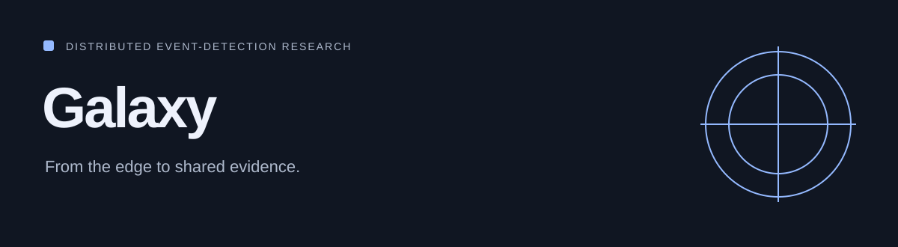

# Galaxy

<!-- repo-badges:start -->
<div align="center">

[](https://github.com/honeyamn10-source/galaxy_mvp/stargazers)
[](https://github.com/honeyamn10-source/galaxy_mvp/forks)
[](https://github.com/honeyamn10-source/galaxy_mvp/issues)
[](https://github.com/honeyamn10-source/galaxy_mvp/commits/main)

[Repository](https://github.com/honeyamn10-source/galaxy_mvp) · [Issues](https://github.com/honeyamn10-source/galaxy_mvp/issues) · [Pull Requests](https://github.com/honeyamn10-source/galaxy_mvp/pulls) · [Actions](https://github.com/honeyamn10-source/galaxy_mvp/actions)

</div>
<!-- repo-badges:end -->

<!-- professional-meta:start -->
<div align="center">

[](https://github.com/honeyamn10-source/galaxy_mvp/actions/workflows/ci.yml) [](https://github.com/honeyamn10-source/galaxy_mvp/actions/workflows/codeql.yml) [](https://github.com/honeyamn10-source/galaxy_mvp/actions/workflows/security-scan.yml)

   

[Architecture](ARCHITECTURE_SUMMARY.md) · [Documentation](docs) · [Contributing](CONTRIBUTING.md) · [Security](SECURITY.md) · [Changelog](CHANGELOG.md)

</div>
<!-- professional-meta:end -->


A development platform exploring edge event detection, swarm propagation and authority-based event verification.

[Project website](https://honeyamn10-source.github.io/galaxy_mvp/) · [Build results](https://github.com/honeyamn10-source/galaxy_mvp/actions)

## What it does

- **Edge.** Python services ingest events and support model-integration paths.
- **Swarm.** Go and libp2p components explore peer propagation with development mTLS certificates.
- **Authority.** Authority services, a dashboard and intelligence layers support verification experiments.

> Development repository. Included federation code, authority scaffolds and Kubernetes templates do not certify a production-ready or compliant system. This guide is not a live swarm dashboard.

## ⚡ Quickstart (Docker Compose)

### Prerequisites

- Docker Engine + Docker Compose plugin
- GNU Make
- Python 3.11+ (optional tests)
- `jq` (recommended)
- **Optional LLM path:** Ollama with a DeepSeek model

### Start the core stack

```bash
make swarm-up
```

After the Make target generates development certificates, you can also use:

```bash
docker compose up -d --build
```

### Verify health

```bash
make health
```

Each service exposes a health endpoint on its own port (`8100`–`8600`).

### Run integration tests

```bash
make test
```

### Run the demo stack

```bash
./demo.sh
```

Demo URLs:

| Service | URL |
| --- | --- |
| Dashboard | http://localhost:8000 |
| Landing page | http://localhost:8080 |
| Authority health | http://localhost:1317/health |
| Authority events | http://localhost:1317/galaxy/v1/events |

For a health-only pass with auto-restart of unhealthy services:

```bash
./preflight.sh
```

### One-click interactive installer

```bash
bash install-galaxy.sh
```

Prompts: Edge API key, optional RTSP URL, compliance region.

## Kubernetes deployment templates

See [PHASE_VI_SETUP.md](PHASE_VI_SETUP.md) and the manifests under [k8s](k8s).

```bash
kubectl apply -f k8s/namespaces.yaml
kubectl apply -f k8s/configmaps.yaml
kubectl apply -f k8s/secrets.yaml.template
kubectl apply -f k8s/deployments/postgres-redis.yaml
kubectl apply -f k8s/deployments/authority-chain.yaml
kubectl apply -f k8s/deployments/swarm-node.yaml
kubectl apply -f k8s/deployments/intelligence-layer.yaml
kubectl apply -f k8s/deployments/expansion-layer.yaml
kubectl apply -f k8s/deployments/dashboard.yaml
kubectl apply -f k8s/services/services.yaml
kubectl apply -f k8s/network-policies.yaml
kubectl apply -f k8s/monitoring/prometheus.yaml
kubectl apply -f k8s/monitoring/grafana.yaml
kubectl apply -f k8s/ingress.yaml
```

## 🤖 Optional local LLM

Start Ollama and pull/verify the model:

```bash
make ollama-up
make llm-up
make test-llm
```

> Linux note: if Ollama runs on the host and `host.docker.internal` is unavailable, use the `172.17.0.1` bridge gateway or run Ollama as a peer container.

## 📁 Repository layout

```
galaxy_mvp/
├── backend/               # Core ingestion/backend services
├── edge-planet/           # Edge inference (YOLO/agent) service
├── swarm-node/            # libp2p swarm mesh with mTLS
├── authority-chain/       # Cosmos-style authority + voting
├── intelligence-layer/    # FL aggregator + predictive service
├── expansion-layer/       # Compliance engine + webhooks
├── economic-layer/        # CosmWasm contracts + economy
├── llm-service/           # Ollama-backed analysis and chat
├── auth-service/          # Authentication
├── workers/               # Background workers
├── frontend/              # Dashboard
├── portfolio/             # Landing/portfolio page
├── k8s/                   # Kubernetes deployment manifests
├── docs/                  # LLM integration guides
├── models/                # Mounted model artifacts
├── scripts/               # Backup/restore and tooling
└── .github/workflows/     # CI/CD and security scanning
```

## 🔧 Configuration

All runtime configuration is environment-driven. Reference: [docker-compose.yml](docker-compose.yml) and [k8s/configmaps.yaml](k8s/configmaps.yaml).

### Core services

| Service | Key environment variables |
| --- | --- |
| authority-chain | `CHAIN_ID`, `CHAIN_VOTE_THRESHOLD`, `CHAIN_COMPLIANCE_URL`, `LLM_SERVICE_URL`, `LLM_TIMEOUT` |
| swarm-node | `SWARM_NODE_NAME`, `SWARM_RENDEZVOUS`, `SWARM_BOOTSTRAP_SEEDS`, `VALIDATOR_GRPC_ADDR` |
| edge-planet | `SWARM_INGEST_URL`, `FL_ENABLED`, `FL_AGGREGATOR_URL`, `FL_SYNC_INTERVAL_SECONDS` |
| fl-aggregator | `FL_DATABASE_URL`, `FL_MODEL_DIR`, `FL_MIN_UPDATES_FOR_AGG` |
| predictive-service | `PRED_AUTHORITY_URL`, `PRED_SWARM_PUBLISH_URL`, `PRED_RISK_THRESHOLD` |
| compliance-engine | `COMPLIANCE_DEFAULT_REGION`, `COMPLIANCE_HIPAA_EVENT_TYPES`, `COMPLIANCE_PII_KEYS` |
| webhook-service | `WEBHOOK_DATABASE_URL`, `WEBHOOK_AUTHORITY_EVENTS_URL`, `WEBHOOK_MAX_RETRIES` |

### LLM service

| Variable | Purpose | Default |
| --- | --- | --- |
| `OLLAMA_URL` | Ollama API base URL | `http://host.docker.internal:11434` |
| `OLLAMA_MODEL` | Local model tag | `deepseek-llm:6.7b` |
| `OLLAMA_TIMEOUT` | Inference timeout (s) | `60` |
| `LLM_ENABLED` | Toggle LLM behavior | `true` |
| `LLM_SERVICE_URL` | Authority gateway target | `http://llm-service:8600` |
| `LLM_TIMEOUT` | Authority→LLM timeout (s) | `30` |

## 📡 API surface

| Component | URL |
| --- | --- |
| Authority REST | `http://localhost:1317` |
| Authority WebSocket | `ws://localhost:26657/websocket` |
| Edge Planet | `http://localhost:8100` |
| FL Aggregator | `http://localhost:8200` |
| Predictive Service | `http://localhost:8300` |
| Compliance Engine | `http://localhost:8400` |
| Webhook Service | `http://localhost:8500` |
| LLM Service | `http://localhost:8600` |

## 🔄 Backup & restore

```bash
bash scripts/backup.sh
bash scripts/restore.sh /path/to/backup.tar.gz
```

## 🛡️ CI/CD & security

- CI: [.github/workflows/ci.yml](.github/workflows/ci.yml)
- CD & Cloudflare Pages: [.github/workflows/cd.yml](.github/workflows/cd.yml) · [cloudflare-pages.yml](.github/workflows/cloudflare-pages.yml)
- Vulnerability scanning: [.github/workflows/security-scan.yml](.github/workflows/security-scan.yml)

Workflows cover linting, tests, container build validation, and vulnerability scanning. See [SECURITY.md](SECURITY.md) to report a vulnerability.

## 📖 Documentation

| Document | Covers |
| --- | --- |
| [ARCHITECTURE_SUMMARY.md](ARCHITECTURE_SUMMARY.md) | System architecture overview |
| [API_INTEGRATION.md](API_INTEGRATION.md) | API integration details |
| [PHASE_I_SETUP.md](PHASE_I_SETUP.md) — [PHASE_VI_SETUP.md](PHASE_VI_SETUP.md) | Phase-by-phase setup guides |
| [docs/LLM_INTEGRATION.md](docs/LLM_INTEGRATION.md) · [docs/LLM_QUICKSTART.md](docs/LLM_QUICKSTART.md) | LLM service integration |
| [STATUS_REPORT.md](STATUS_REPORT.md) | Development status |

## 🩺 Troubleshooting

| Symptom | Resolution |
| --- | --- |
| `docker-compose` not found | Use `docker compose up -d` (plugin syntax) on modern Docker |
| Service unhealthy / restart loops | `make logs`, validate `docker compose config`, confirm dependency health returns 200 |
| LLM cannot reach Ollama | Verify `curl http://localhost:11434/api/tags`; set `OLLAMA_URL` per environment |
| Swarm TLS errors | `make swarm-certs && make swarm-down && make swarm-up` |
| Inconsistent PostgreSQL state | `make clean && make swarm-up` |

## 🤝 Contributing

Contributions, issues, and feature requests are welcome. Read [CONTRIBUTING.md](CONTRIBUTING.md) first and review the [Code of Conduct](CODE_OF_CONDUCT.md).

## 📄 License

[MIT](LICENSE) © 2026 [Bittu Sharma](https://github.com/honeyamn10-source)
