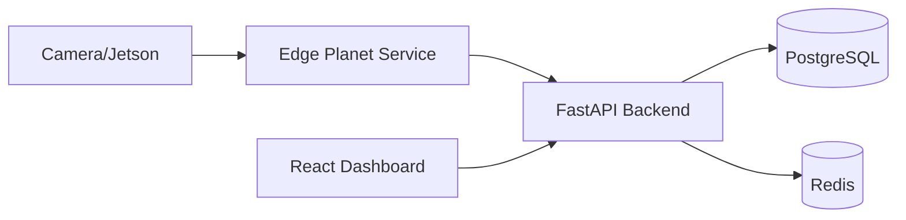
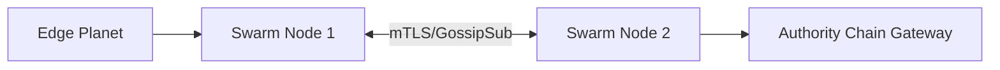
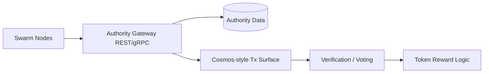
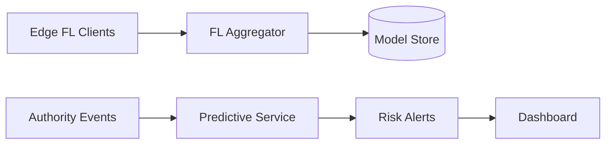
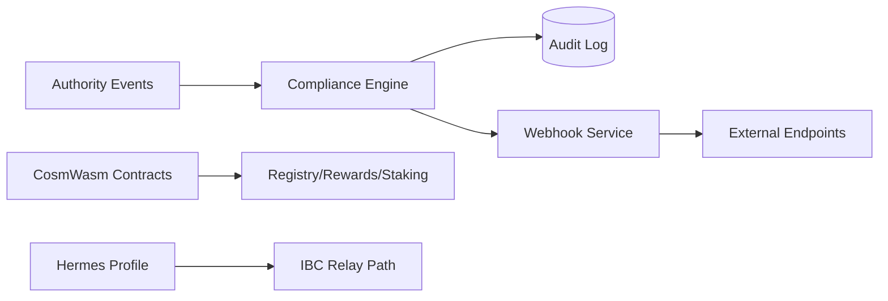
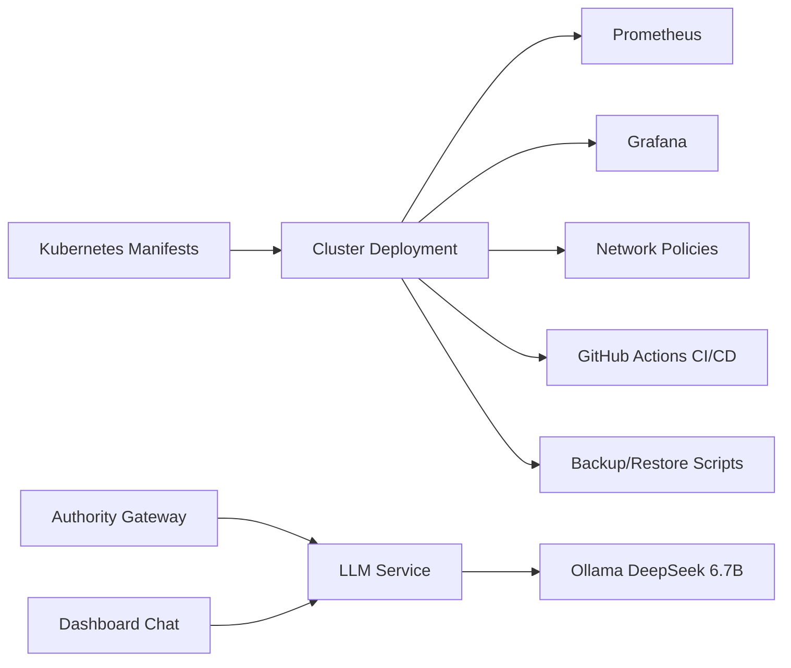

# Enhanced Autonomous Cognitive Galaxy v2.0

Production-ready, decentralized AI event detection platform that combines edge inference, secure swarm propagation, blockchain authority, federated intelligence, compliance automation, Kubernetes hardening, and optional local LLM augmentation.

## What This Project Delivers

- Edge AI event detection with multi-tenant ingestion
- Secure peer-to-peer propagation over libp2p swarm with mTLS
- Blockchain-backed verification and reward logic
- Federated learning aggregation and predictive analytics
- Expansion layer with compliance transformation and webhook delivery
- Production hardening with Kubernetes, monitoring, backup/restore, and CI/CD
- Optional local DeepSeek LLM integration (via Ollama) for nuanced verification and chat

## Phase Status

| Phase | Name | Status | Core Outcome |
|---|---|---|---|
| I | Edge & Backend | Complete | FastAPI backend, dashboard, PostgreSQL, Redis, edge ingestion |
| II | Swarm Mesh | Complete | libp2p event mesh with mTLS and validator forwarding |
| III | Blockchain Authority | Complete | Cosmos-like authority node and event voting surfaces |
| IV | Intelligence | Complete | FL aggregator and predictive risk service |
| V | Expansion & Economy | Complete | Compliance engine, webhooks, CosmWasm contracts, Hermes profile |
| VI | Production Hardening | Complete | Kubernetes manifests, monitoring stack, CI/CD, backups |
| LLM | DeepSeek Integration | Complete | Ollama-backed analysis and chat endpoints |

## High-Level Architecture

```mermaid
flowchart LR
  EP[Edge Planet]\nYOLO/Agent --> SN1[Swarm Node 1]
  SN1 --> SN2[Swarm Node 2]
  SN1 --> AC[Authority Chain Gateway]
  AC --> DB[(PostgreSQL)]
  AC --> RD[(Redis)]
  AC --> CE[Compliance Engine]
  CE --> WS[Webhook Service]
  AC --> FL[FL Aggregator]
  AC --> PR[Predictive Service]
  AC --> LLM[LLM Service]
  LLM --> OLL[Ollama DeepSeek]
  FE[Dashboard] --> AC
  FE --> PR
  FE --> LLM
```

## Layer Diagrams

### Phase I: Edge and Backend



### Phase II: Swarm Mesh



### Phase III: Blockchain Authority



### Phase IV: Intelligence Layer



### Phase V: Expansion Layer



### Phase VI + LLM: Hardening and AI Verifier Augmentation



## Repository Map

- [docker-compose.yml](docker-compose.yml): Full local stack composition
- [Makefile](Makefile): Operational shortcuts
- [PHASE_I_SETUP.md](PHASE_I_SETUP.md): Phase I setup details
- [PHASE_II_SETUP.md](PHASE_II_SETUP.md): Swarm setup details
- [PHASE_III_SETUP.md](PHASE_III_SETUP.md): Authority-chain setup details
- [PHASE_IV_SETUP.md](PHASE_IV_SETUP.md): Intelligence-layer setup details
- [PHASE_V_SETUP.md](PHASE_V_SETUP.md): Expansion/economy setup details
- [PHASE_VI_SETUP.md](PHASE_VI_SETUP.md): Kubernetes and production hardening
- [docs/LLM_INTEGRATION.md](docs/LLM_INTEGRATION.md): LLM service integration details
- [docs/LLM_QUICKSTART.md](docs/LLM_QUICKSTART.md): LLM quickstart guide
- [k8s](k8s): Kubernetes deployment manifests
- [scripts/backup.sh](scripts/backup.sh): Backup automation
- [scripts/restore.sh](scripts/restore.sh): Restore flow

## Quickstart (Local Docker Compose)

### 1) Prerequisites

- Docker Engine + Docker Compose plugin
- Make
- Python 3.11+ (for optional tests)
- jq (recommended for JSON inspection)
- Optional LLM path: Ollama with DeepSeek model

### 2) Start Core Stack

```bash
make swarm-up
```

Alternative:

```bash
docker-compose up -d --build
```

### 3) Check Service Health

```bash
make health
curl -s http://localhost:8100/health
curl -s http://localhost:8200/health
curl -s http://localhost:8300/health
curl -s http://localhost:8400/health
curl -s http://localhost:8500/health
```

### 4) Run Integration Test

```bash
make test
```

### 5) Optional LLM Enablement

Start Ollama and model:

```bash
make ollama-up
```

Start and test LLM service:

```bash
make llm-up
make test-llm
```

## One-Click Installer

Use the interactive installer to detect OS, validate ports, configure runtime values, pull GHCR images, and start the stack.

```bash
bash install-galaxy.sh
```

Installer prompts:

- Edge API key
- RTSP URL (optional)
- Compliance region

## Paperclip Governance Layer

Paperclip can orchestrate Galaxy autonomous workflows as a control-plane "board of directors".

### Local startup

```bash
npx -y paperclipai onboard --yes
npx -y paperclipai run
```

Paperclip local UI/API:

- UI: `http://localhost:3100` (or next free port selected by Paperclip)
- API health: `http://127.0.0.1:3100/api/health` (use matching fallback port if 3100 is busy)

### Workflow skills

Skill definitions are provided in `.paperclip/skills/`:

- `galaxy-autonomous-loop.yaml`
- `galaxy-pages-deploy.yaml`
- `galaxy-worker-deploy.yaml`

Each skill dispatches the corresponding workflow through the GitHub Actions workflow dispatch API.

### Token setup

Set a GitHub PAT with `repo` and `workflow` scopes before running Paperclip-triggered actions:

```bash
export GITHUB_TOKEN=<your_pat>
```

Full setup guide: `PAPERCLIP_INTEGRATION.md`

## Cloudflare Pages Zero-Touch CI/CD

This repository now includes fully automated Cloudflare Pages deployment via GitHub Actions.

Workflow file:

- `.github/workflows/cloudflare-pages.yml`

Auto-detection supports:

- React
- Vite
- Next.js
- Static HTML

For this repository, static deployment target is `docs/landing`.

### Initial one-time setup (required)

Add these GitHub repository secrets:

- `CLOUDFLARE_API_TOKEN`
- `CLOUDFLARE_ACCOUNT_ID`
- `CF_PAGES_PROJECT_NAME`

After this one-time setup, every push to `main` deploys automatically and every pull request creates a preview deployment.

### Build/output mapping

- React/Vite: `npm run build` -> `dist` or `build` (auto-detected)
- Next.js: `npm run build` -> `.next`
- Static: no build -> `/` (deployed from detected static app directory)

### Deployment behavior

- Automatically installs missing dependencies when needed
- Retries Cloudflare deployment up to 3 times
- Validates output directory and falls back safely for static sites
- Writes deployment URL in GitHub Actions step summary

## Cloud Demo Deployment (Ubuntu 22.04)

Use the demo deployment script on a fresh VM. It installs Docker, deploys the stack, and configures nginx basic auth.

```bash
sudo bash deploy-demo.sh
```

Environment overrides:

```bash
sudo DEMO_AUTH_USER=admin DEMO_AUTH_PASS='strong-password' bash deploy-demo.sh
```

## Desktop App (Tauri Skeleton)

A desktop launcher skeleton is available in [galaxy-desktop](galaxy-desktop).

```bash
cd galaxy-desktop
npm install
npm run tauri dev
```

It provides:

- Embedded dashboard webview
- Tray actions to start/stop stack
- Dashboard open action

## Custom AI Models and Real Cameras

Edge service supports mounted models and optional RTSP input configuration through env vars.

- Model mount path: `./models` on host -> `/models` in container
- Active model env: `MODEL_PATH`
- Camera source env: `RTSP_URL`

Create `.env` from [.env.example](.env.example) and set values:

```bash
cp .env.example .env
```

## Configuration Reference

All runtime configuration is environment-driven. Main references are in [docker-compose.yml](docker-compose.yml) and [k8s/configmaps.yaml](k8s/configmaps.yaml).

### Core Services

| Service | Key Environment Variables |
|---|---|
| authority-chain | CHAIN_ID, CHAIN_VOTE_THRESHOLD, CHAIN_COMPLIANCE_URL, LLM_SERVICE_URL, LLM_TIMEOUT |
| swarm-node | SWARM_NODE_NAME, SWARM_RENDEZVOUS, SWARM_BOOTSTRAP_SEEDS, VALIDATOR_GRPC_ADDR |
| edge-planet | SWARM_INGEST_URL, FL_ENABLED, FL_AGGREGATOR_URL, FL_SYNC_INTERVAL_SECONDS |
| fl-aggregator | FL_DATABASE_URL, FL_MODEL_DIR, FL_MIN_UPDATES_FOR_AGG |
| predictive-service | PRED_AUTHORITY_URL, PRED_SWARM_PUBLISH_URL, PRED_RISK_THRESHOLD |
| compliance-engine | COMPLIANCE_DEFAULT_REGION, COMPLIANCE_HIPAA_EVENT_TYPES, COMPLIANCE_PII_KEYS |
| webhook-service | WEBHOOK_DATABASE_URL, WEBHOOK_AUTHORITY_EVENTS_URL, WEBHOOK_MAX_RETRIES |

### LLM Service

| Variable | Purpose | Default |
|---|---|---|
| OLLAMA_URL | Ollama API base URL | http://host.docker.internal:11434 |
| OLLAMA_MODEL | Local model tag | deepseek-llm:6.7b |
| OLLAMA_TIMEOUT | Ollama inference timeout seconds | 60 |
| LLM_ENABLED | Enable/disable LLM service behavior | true |
| LLM_SERVICE_URL | Authority gateway target URL | http://llm-service:8600 |
| LLM_TIMEOUT | Authority-to-LLM timeout seconds | 30 |

Linux note: if Ollama runs on host and host.docker.internal is unavailable, use 172.17.0.1 bridge gateway or run Ollama as a peer container.

## API and Access Points

| Component | URL |
|---|---|
| Authority REST | http://localhost:1317 |
| Authority WebSocket | ws://localhost:26657/websocket |
| Edge Planet | http://localhost:8100 |
| FL Aggregator | http://localhost:8200 |
| Predictive Service | http://localhost:8300 |
| Compliance Engine | http://localhost:8400 |
| Webhook Service | http://localhost:8500 |
| LLM Service | http://localhost:8600 |

## Kubernetes Deployment Path (Phase VI)

For production deployment, use [PHASE_VI_SETUP.md](PHASE_VI_SETUP.md) and manifests under [k8s](k8s).

Typical order:

```bash
kubectl apply -f k8s/namespaces.yaml
kubectl apply -f k8s/configmaps.yaml
kubectl apply -f k8s/secrets.yaml.template
kubectl apply -f k8s/deployments/postgres-redis.yaml
kubectl apply -f k8s/deployments/authority-chain.yaml
kubectl apply -f k8s/deployments/swarm-node.yaml
kubectl apply -f k8s/deployments/intelligence-layer.yaml
kubectl apply -f k8s/deployments/expansion-layer.yaml
kubectl apply -f k8s/deployments/dashboard.yaml
kubectl apply -f k8s/services/services.yaml
kubectl apply -f k8s/network-policies.yaml
kubectl apply -f k8s/monitoring/prometheus.yaml
kubectl apply -f k8s/monitoring/grafana.yaml
kubectl apply -f k8s/ingress.yaml
```

## CI/CD and Security

- CI pipeline: [.github/workflows/ci.yml](.github/workflows/ci.yml)
- CD pipeline: [.github/workflows/cd.yml](.github/workflows/cd.yml)
- Security scanning: [.github/workflows/security-scan.yml](.github/workflows/security-scan.yml)

These workflows cover linting, tests, container build validation, and vulnerability scanning.

## Backup and Restore

- Backup script: [scripts/backup.sh](scripts/backup.sh)
- Restore script: [scripts/restore.sh](scripts/restore.sh)

Run manually:

```bash
bash scripts/backup.sh
bash scripts/restore.sh /path/to/backup.tar.gz
```

## Troubleshooting

### Docker Compose command not found

Use Docker Compose plugin syntax on modern Docker:

```bash
docker compose up -d
```

If this repo commands use docker-compose, install compatibility package or alias.

### Service unhealthy or restart loops

- Check logs: `make logs`
- Validate compose expansion: `docker compose config`
- Confirm dependency health endpoints return 200

### LLM service cannot reach Ollama

- Verify host Ollama: `curl http://localhost:11434/api/tags`
- From llm-service container, test configured OLLAMA_URL
- Switch OLLAMA_URL based on environment:
  - Docker Desktop: host.docker.internal
  - Linux host bridge: 172.17.0.1
  - Sidecar container: ollama:11434

### Swarm TLS errors

Regenerate certs and restart:

```bash
make swarm-certs
make swarm-down
make swarm-up
```

### PostgreSQL state issues

If local data is inconsistent:

```bash
make clean
make swarm-up
```

## Operational Commands

```bash
make help
make up
make down
make ps
make logs
make test
make chain-unit-test
make contracts-test
make ibc-up
make test-llm
```

## Compatibility and Safety Notes

- Backward-compatible defaults are preserved across phases.
- Optional integrations (IBC profile, LLM service) are toggleable by profile/env.
- Health endpoints exist for runtime services and are wired into Compose/Kubernetes probes.
- Configuration is environment-variable based; avoid hardcoding secrets in manifests.

## License and Contribution

Internal project guidelines apply. Keep changes minimal, typed where applicable, and accompanied by docs/test updates for any contract changes.
